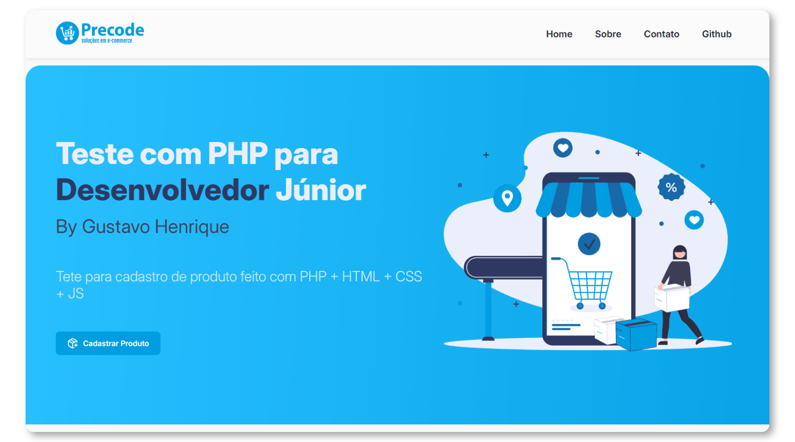

<h1 align="center">Teste para Desenvolvedor Júnior</h1>

<p align="center">
    
    
    
    
</p>

<p align="center"></p>

## :page_with_curl: Descrição
O teste consiste em cadastrar um produto na API da Precode. Deve ser desenvolvido uma tela (HTML / CSS) em que possa ser preenchido dos dados do produto e ao disparar o formulário, fzendo uma requisição na API enviando os dados do produto, capturando a resposta e mostrando na tela qual o retorno (sucesso ou erro).

## :game_die: Tarefas
- [x] Cadastrar Produto
- [x] Criar querys no banco PostgreSQL

## :gear: Rodando

### Variáveis de ambiente
Crie uma cópia do arquivo ```.env.example``` como ```.env```
```
copy .env.example .env.local
```

### Instalar Dependências
```
composer install
```

## :hammer_and_wrench: Tools
<p>
  
  
  
  
  
  
</p>

## :adult: Autores

<!-- ALL-CONTRIBUTORS-LIST:START - Do not remove or modify this section -->
<!-- prettier-ignore-start -->
<!-- markdownlint-disable -->
<table>
  <tbody>
    <tr>
      <td align="center" valign="top" width="14.28%"><a href="https://gustavohenrique.vercel.app/"><br /><sub><b>Gustavo Henrique</b></sub></a><br /><a href="#code-Gustavohps10" title="Code">💻</a></td>
    </tr>
  </tbody>
</table>

<!-- markdownlint-restore -->
<!-- prettier-ignore-end -->

<!-- ALL-CONTRIBUTORS-LIST:END -->
