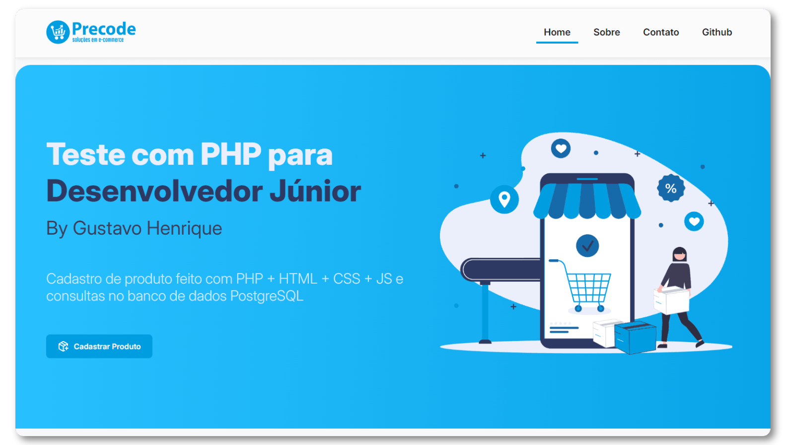

<h1 align="center"><div align="center"></div>Teste para Desenvolvedor Júnior</h1>

<p align="center">
    
    
    
    
</p>

<p align="center"></p>

## :page_with_curl: Descrição
O teste consiste em cadastrar um produto na API da Precode. Deve ser desenvolvido uma tela (HTML / CSS) em que possa ser preenchido dos dados do produto e disparar o formulário, fazendo uma requisição na API enviando os dados, capturando a resposta e mostrando na tela qual o retorno (sucesso ou erro).
> ❗ Não foi utilizado nenhum framework robusto como Laravel ou CodeIgniter, apenas o [Coffeecode Router](https://packagist.org/packages/coffeecode/router) para lidar com roteamento e requisições e o [PlatesPHP](https://platesphp.com/) para criar templates. Também não foi utilizado nenhum framework css como Tailwind ou Bootstrap, apenas CSS e JavaScript puro.

#### :clapper: Video da aplicação
> Acesse aqui: [Video](https://player.livepush.io/emvH4PeH_-_VG)
 
#### :mag_right: Scripts PostgreSQL
> Você pode acessar aqui: [scripts.sql](https://github.com/Gustavohps10/teste-precode/blob/main/scripts.sql)

## :dart: Tarefas
- [x] Cadastrar Produto
- [x] Criar consultas no banco PostgreSQL
- [ ] Ajustar responsividade
- [ ] Conteinerização com Docker

## :pushpin: Requisitos
- [XAMPP (PHP 8.0.30)](https://www.apachefriends.org/pt_br/download.html) (necessário servidor Apache para o roteamento funcionar)
- [Composer](https://getcomposer.org/download/)

## :gear: Rodando

### Clonando
Faça o Fork e clone este repositório
```
git clone https://github.com/<your-profile>/teste-precode
```

### Variáveis de ambiente
Crie uma cópia do arquivo ```.env.example``` como ```.env```
```
copy .env.example .env
```
Defina a variável `PRECODE_API_TOKEN=` Exemplo: `aBcDeFVLZ09EZnRvO1234567`

### Instalar Dependências
```
composer install
```

### Iniciando servidor Apache
Abra o XAMPP e inicie o Apache
>⚠️ Certifique-se de que o projeto esteja na sua pasta `htdocs`

## :hammer_and_wrench: Ferramentas utilizadas
<p>
  
  
  
  
  
  
  
  
</p>

## :adult: Autores

<!-- ALL-CONTRIBUTORS-LIST:START - Do not remove or modify this section -->
<!-- prettier-ignore-start -->
<!-- markdownlint-disable -->
<table>
  <tbody>
    <tr>
      <td align="center" valign="top" width="14.28%"><a href="https://gustavohenrique.vercel.app/"><br /><sub><b>Gustavo Henrique</b></sub></a><br /><a href="#code-Gustavohps10" title="Code">💻</a></td>
    </tr>
  </tbody>
</table>

<!-- markdownlint-restore -->
<!-- prettier-ignore-end -->

<!-- ALL-CONTRIBUTORS-LIST:END -->
